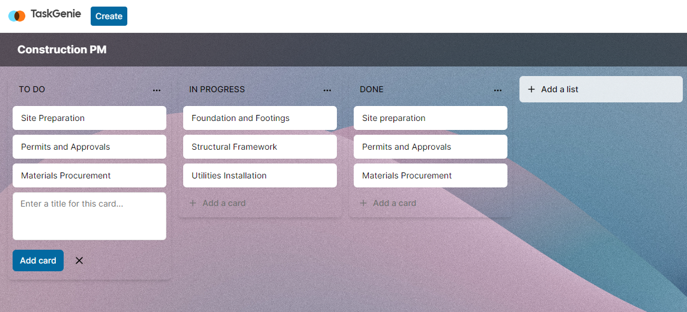

# TaskGenie

TaskGenie is an innovative and collaborative project management tool crafted to streamline workflow organization and amplify productivity. Much akin to Trello, it offers a flexible platform for teams and individuals to handle tasks, structure projects, and monitor progress in real-time.



TaskGenie is built using modern web technologies and follows a scalable and efficient web architecture, leveraging technologies like Next.js 14, Server Actions, React, Prisma, Stripe, Tailwind and PostgreSQL.

## Key Features

+ **Auth:** Secure authentication system for users
+ **Organizations / Workspaces:** Create and manage workspaces for teams
+ **Board Creation:** Easily create boards to manage projects
+ **Unsplash API Integration:** Access random beautiful cover images for boards
+ **Activity Log:** Track actions and changes within the entire organization
+ **Board Operations:** Rename, delete, and manage boards within the organization
+ **List Management:** Create, rename, delete, reorder, and copy lists within boards
+ **Card Operations:** Create, manage, and organize cards within lists
+ **Card Details:** Add descriptions, rename, delete, and track card activity
+ **Organization Limit:** Set board limits for each organization
+ **Stripe Subscription:** Enable subscription for unlimited boards per organization
+ **Landing Page:** Engaging landing page for users
+ **Data Management:** PostgreSQL DB with Prisma ORM
+ **UI Frameworks:** shadcnUI & TailwindCSS

### Prerequisites

**Node version v20.10.0**

### Cloning the repository

```shell
git clone https://github.com/swoji/robo.git
```

### Install packages

```shell
npm i
```

### Setup .env file

```js
NEXT_PUBLIC_CLERK_PUBLISHABLE_KEY=
CLERK_SECRET_KEY=
NEXT_PUBLIC_CLERK_SIGN_IN_URL=
NEXT_PUBLIC_CLERK_SIGN_UP_URL=
NEXT_PUBLIC_CLERK_AFTER_SIGN_IN_URL=
NEXT_PUBLIC_CLERK_AFTER_SIGN_UP_URL=

DATABASE_URL=

NEXT_PUBLIC_UNSPLASH_ACCESS_KEY=

STRIPE_API_KEY=

NEXT_PUBLIC_APP_URL=

STRIPE_WEBHOOK_SECRET=
```

### Setup Prisma

Add PostgreSQL DB (You can use hosting of choice e.g PlanetScale, Supabase)

```shell
npx prisma generate
npx prisma db push

```

### Available commands

Running commands with npm `npm run [command]`

| command         | description                              |
| :-------------- | :--------------------------------------- |
| `dev`           | Starts a development instance of the app |

### Usage

+ Register for an account or log in if you already have one.
+ Create a new board for your project.
+ Add lists within the board to represent different stages or categories.
+ Create cards within lists, detailing tasks or items to be done.
+ Drag and drop cards between lists to update their status.
+ Invite team members to collaborate on the board by adding them as members.
+ Utilize comments, due dates, and other features for effective progress management.

### Contributing

+ We welcome contributions! To contribute to TaskGenie, follow these steps:

  + Fork this repository.
  + Create a new branch: git checkout -b feature/new-feature
  + Make your changes and commit them: git commit -m 'Add new feature'
  + Push to the branch: git push origin feature/new-feature
  + Submit a pull request detailing your changes.
